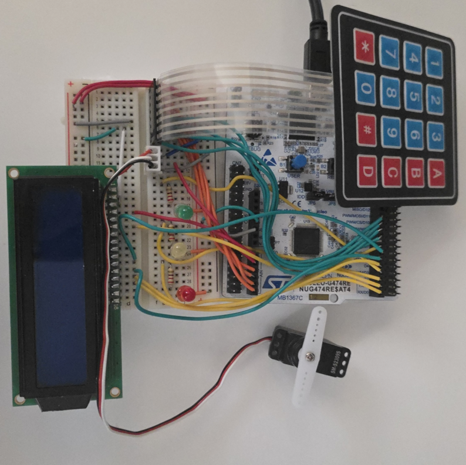
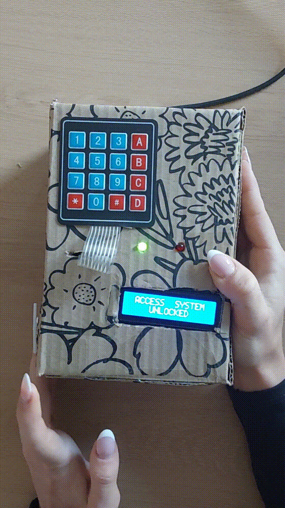

# STM32 Secure Access System

I built an embedded access control system using an STM32 NUCLEO-G474RE (Arm Cortex-M4) development board and a real-time operating system (FreeRTOS) to manage concurrent tasks.
It uses a keypad for PIN entry, an LCD screen for user feedback, a servo motor for the locking mechanism, LEDs to show the system status and a UART terminal for admin control.

## Hardware Setup

<table>
  <tr>
    <td width="50%" valign="top">

- NUCLEO-G474RE development board
- 4x4 keypad
- 16x2 LCD display
- Servo motor
- Green, yellow, and red LEDs
- Push button
- Breadboard

    </td>
    <td width="50%" align="center">
      
    </td>
  </tr>
</table>

## Features

### User Access
- 4x4 keypad PIN authentication
- Multiple user accounts
- Masked PIN entry on a 16x2 LCD
- Servo-controlled locking mechanism
- Red and green LED access indicators

### Security & System Behaviour
- Automatic relocking after a defined timeout
- Failed-attempt tracking
- Temporary lockout after repeated incorrect PIN attempts
- Button input with debounce handling
- Concurrent task management using FreeRTOS

### Admin Access
- UART terminal interface
- Add new users through the UART menu
- View registered users
- Lock and unlock the system through UART

## Demo

<p align="center">
  
</p>

## System Overview

The flowchart below shows how the different peripherals, actuators and system components work together during user and admin interaction.

<p align="center">
  
</p>

### User Access

The system begins in a locked state.

Users enter a four-digit PIN using the keypad, with each digit displayed as an asterisk on the LCD to keep the PIN hidden.

When `#` is pressed, the entered PIN is submitted for validation.

If the PIN matches an active user:

- access is granted
- the system changes to the unlocked state
- the green LED is activated
- the servo moves to the unlocked position
- the user's name is displayed on the LCD
- the system automatically relocks after a timeout

If an incorrect PIN is entered, the failed-attempt counter is increased. After three unsuccessful attempts, the system enters a temporary lockout period before allowing another attempt.

### Admin Access

The UART terminal provides a separate admin interface for controlling and managing the system. I used UART for the serial communication between the board and my laptop.

The following options are available:

```text
--- Secure Access System ---

1 - Unlock door
2 - Lock door
3 - Status
4 - Add user
5 - View users
>
```

New users can be added by entering a name followed by a four-digit PIN. The system validates the PIN before adding the user and prevents duplicate PINs from being registered.

## FreeRTOS Tasks

FreeRTOS is used to divide the system into separate concurrent tasks, allowing different parts of the system to run independently while sharing the current system state.

### AccessControlTask

Handles the main system logic, including:

- PIN validation
- failed-attempt tracking
- temporary lockout timing
- automatic relocking
- UART command processing
- user management
- access-state changes

### KeyboardTask

Continuously scans the 4x4 keypad and handles PIN entry.

- accepts numeric input
- masks entered digits on the LCD
- clears the current PIN when `*` is pressed
- submits the PIN when `#` is pressed

### ServoTask

Monitors the current access state and uses PWM (Pulse Width Modulation) to move the servo between the locked and unlocked positions when the state changes.

### LCD Task

Updates the LCD when the access state changes and avoids overwriting PIN-entry or lockout messages.

### Button Task

Monitors the physical push button, applies software debounce handling and activates the associated LED output when the button is pressed.

## Technologies & Hardware

| **Technologies & Interfaces** | **Hardware & Embedded Skills** |
|---|---|
| C | Breadboard prototyping |
| STM32 HAL | Circuit wiring |
| FreeRTOS | Hardware interfacing |
| STM32CubeIDE & STM32CubeMX | Keypad integration |
| UART | LCD integration |
| GPIO | LED and push-button integration |
| PWM | Servo motor control |
| Hardware timers | Embedded hardware/software integration |

## Project Structure

```text
Core/
├── Inc/
│   ├── main.h
│   └── LCD1602.h
│
└── Src/
    ├── main.c
    ├── LCD1602.c
    └── app_freertos.c

Drivers/
Middlewares/

Secure_Access_Management_System.ioc
```

Most of the application logic is contained within `Core/Src/main.c`, while the remaining files include the LCD driver, FreeRTOS configuration, STM32 HAL drivers and project configuration.

## Building the Project

### Requirements

- NUCLEO-G474RE development board
- STM32CubeIDE
- `Secure_Access_Management_System.ioc` configuration
- USB connection for programming/debugging through ST-LINK
- Serial terminal software, such as **PuTTY**, Tera Term or another UART-capable terminal

### Setup

1. Clone the repository:

```bash
git clone https://github.com/juliaadamson/stm32-secure-access-system.git
```

2. Open **STM32CubeIDE** and import the cloned project using **File → Open Projects from File System**. The included `Secure_Access_Management_System.ioc` file contains the STM32CubeMX configuration for the NUCLEO-G474RE.

3. Connect the hardware components using the [Pin Configuration](#pin-configuration) section below.

4. Connect the STM32 NUCLEO-G474RE development board.

5. Build and flash the project to the microcontroller.

6. Open a serial terminal, such as **PuTTY**, select the COM port assigned to the NUCLEO board and use the following settings:

```text
115200 baud
8 data bits
No parity
1 stop bit
```
> In Windows, the correct COM port can be found in **Device Manager → Ports (COM & LPT)** by locating the ST-LINK Virtual COM Port.

7. Use the keypad or UART terminal to interact with the system.

## Future Improvements

This project was part of my Embedded Systems university module. If I continued developing it, I would improve it by:

- splitting more of the application logic into separate modules to make the code easier to maintain and test
- storing user credentials in a cloud database so users and access permissions could be managed more easily and retained outside the device
- improving PIN security by storing hashed credentials instead of plain-text values
- adding different access levels for different users, such as standard user and administrator roles
- keeping a log of access attempts and system events so successful and failed entries could be reviewed
- adding multi-factor authentication
- making better use of FreeRTOS communication features such as queues, mutexes and event flags to improve communication between tasks

## Pin Configuration

The following pin mapping is included as a reference for the hardware configuration used in this project.

| Component | Signal | STM32 Pin | NUCLEO Header | Configuration |
|---|---|---:|---:|---|
| Keypad | Column 1 | PB0 | A3 | GPIO Input, pull-up |
| Keypad | Column 2 | PA4 | A2 | GPIO Input, pull-up |
| Keypad | Column 3 | PC1 | A4 | GPIO Input, pull-up |
| Keypad | Column 4 | PC0 | A5 | GPIO Input, pull-up |
| Keypad | Row 1 | PA9 | D8 | GPIO Output |
| Keypad | Row 2 | PC7 | D9 | GPIO Output |
| Keypad | Row 3 | PB6 | D10 | GPIO Output |
| Keypad | Row 4 | PA7 | D11 | GPIO Output |
| LCD | RS | PA0 | A0 | GPIO Output |
| LCD | Enable | PC4 | D1 | GPIO Output |
| LCD | DB4 | PB10 | D6 | GPIO Output |
| LCD | DB5 | PB4 | D5 | GPIO Output |
| LCD | DB6 | PB5 | D4 | GPIO Output |
| LCD | DB7 | PC5 | D0 | GPIO Output |
| Servo motor | Control | PA1 | A1 | TIM2 CH2 PWM |
| Green LED | Status | PB3 | D3 | GPIO Output |
| Yellow LED | Status | PA10 | D2 | GPIO Output |
| Red LED | Status | PA8 | D7 | GPIO Output |
| Push button | Input | PC13 | — | GPIO Input |
| UART | TX | PA2 | — | USART2 TX |
| UART | RX | PA3 | — | USART2 RX |

### LCD Wiring

| LCD Pin | Connection | Purpose |
|---|---|---|
| VSS | GND | Ground |
| VDD | 5V | Power |
| V0 | Potentiometer | Contrast adjustment |
| RS | PA0 | Register select |
| R/W | GND | Write mode |
| E | PC4 | Enable |
| DB4 | PB10 | Data |
| DB5 | PB4 | Data |
| DB6 | PB5 | Data |
| DB7 | PC5 | Data |
| LED+ | 5V | Backlight anode |
| LED- | GND | Backlight cathode |

### Servo Wiring

| Wire | Connection |
|---|---|
| Brown | GND |
| Red | 5V |
| White | PA1 / TIM2 CH2 PWM |

## Acknowledgements

The LCD1602 driver is based on code by **Controllerstech** and was adapted for the GPIO configuration used in this project.
